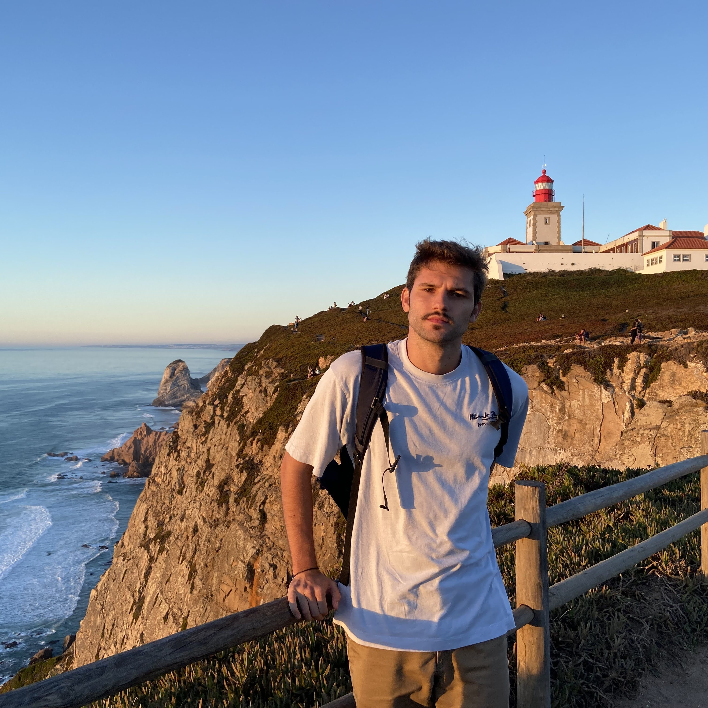

<!--<figure style="width: 400px" class="align-center">
  
</figure>-->

Hi, I'm Pietro Sillano, a **Physics student**  in my second year in Msc. Physics of Complex Systems at the University of Turin.
My main interest of research is **BioPhysics** and how we can represent many biological phenomena using physics methods and frameworks in particular Statistical Physics.
Moreover thanks to some lectures, I got interested in **ML & AI** and I joined the  <a href="https://www.mljc.it/"> <b>Machine Learning Journal Club  </b> </a>, a student organization from Turin which aims to fill the gap between students and researchers in Machine & Deep Learning related fields.

<!--
### Experiences

In summer 2021 I did an Internship at Nicolaus Copernicus University in Torun (Poland) about applied machine learning and network theory.
We also collaborate with History department working on some Natural Language Processing on ancient Latin texts.-->

<!--When I have free time I work on some personal project about techIf you're interested check out my blog posts and my github pages!-->

<h2> Why SullivanStuff? </h2> 
There was a inside joke between me and my roommates and we choose three pseudonyms and "Sullivan" is from my surname; while "stuff" well..I have many interests and I really like to experiment, learn, "do stuff" and this is my attempt to write about them (Hoping to improve my writing skills as well).

I will talk mainly about my experience as physics student and as AI & ML & tech passionate for the more serious & technical section of this blog; while in the future I want to start writing about books and my passion for cooking.

See you there!

<h2> Resume </h2>
 
Take a look at my <a href="../assets/docs/cv.pdf"> <b> resume</b>.
</a>

