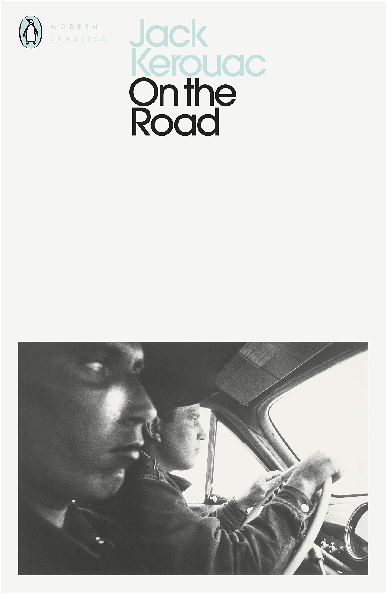
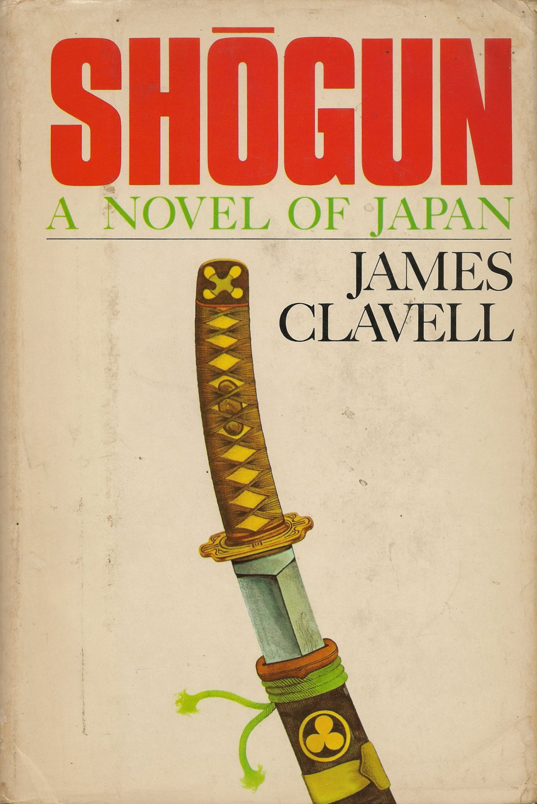
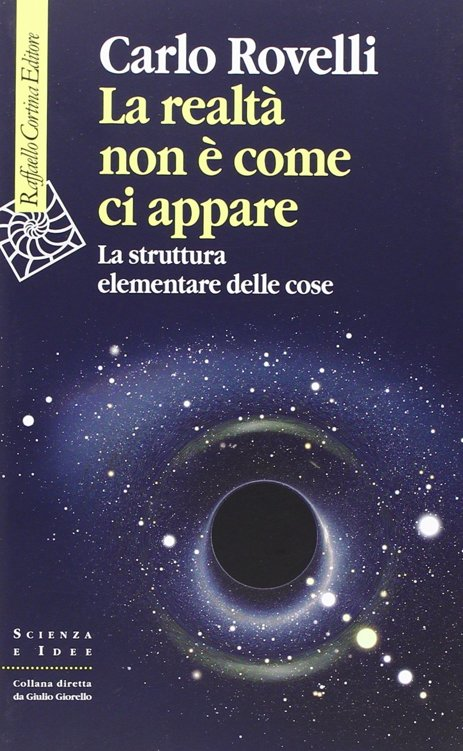
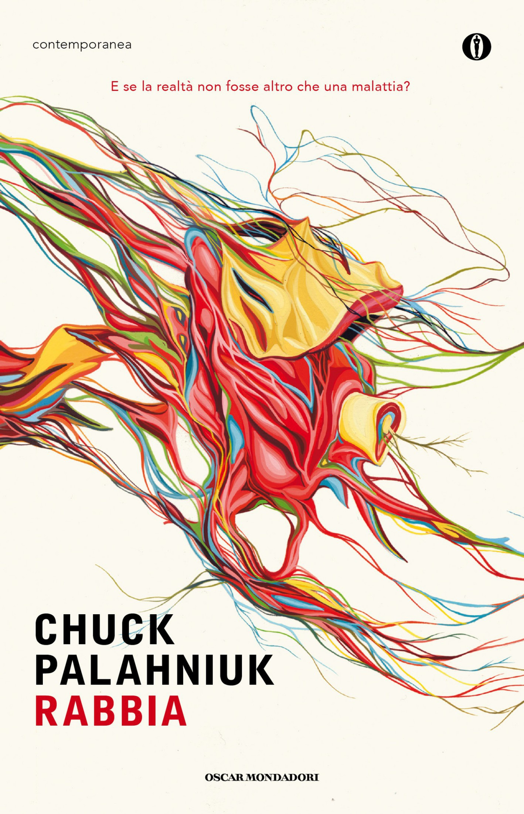
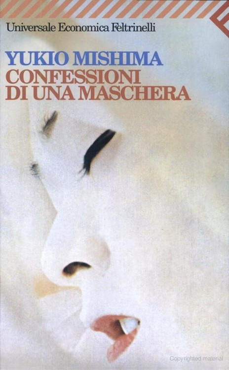
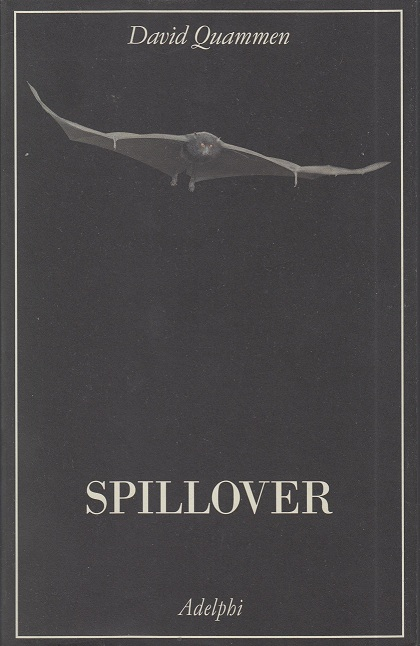

---
title: "Visual Library" 
sitemap: true 
permalink: /books/ 
author_profile: true 
last_modified_at: 2022-04-27 
--- 

Here I collect some of the last books that I particularly enjoyed reading

<figure class="third ">
  <a href="../assets/img/books/selfish_gene.jpg ">    
<!--   <figcaption>The selfish gene</figcaption> -->
 </a>
    
    
    
    
    
    
    
    
    
    
    
    
    
    
</figure>