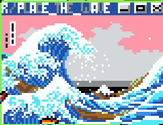

# Introduction

<!-- https://www.youtube.com/watch?v=K5O3UgLG2Jw&t=23s -->

<figure class="third">
  

  

  

  

  

  

  
  <figcaption> Some of the artworks emerged on the canvas </figcaption>

</figure>

# Data and metrics

# Datasets Used

# Users interactions

# Results

# Future Developments

# Code
If you’re interested take a look at the code implemented on my [Github](https://github.com/pietro-sillano/place_network)

# References
I based my work on:
- Rappaz, Jérémie, Michele Stack, Robert West, and Karl Aberer. "Latent structure in collaboration: the case of Reddit R / place." In Twelfth International AAAI Conference on Web and Social Media. 2018.
- Ying Fan, Menghui Li, Peng Zhang, Jinshan Wu, Zengru Di. "The effect of weight on community structure of networks" in PHYSICA A 378 (2007) 583–590
