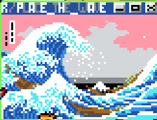

---
title: "title"
# categories:
#  - project--> 
#  tags:
#  - Physics Simulation
cover-img: ../emfield/field.png
toc: false
#toc_sticky: true
#author_profile: true
classes: false
--- 

<!-- USARE LE EQUAZIONI DI LATEX CON LABEL PER REFS -->
\begin{equation} \label{eq:1}
\end{equation}

<!-- RIFERIRSI A UN EQUAZIONE DEFINITA  -->
\eqref{eq:1}

<!--  Una immagine semplice centrata -->
! [True and reconstructed attractor] (sindy / attractor.png) {width = "\\textwidth"}

<!-- Inserire due immagini (tre se uso third)  -->
<figure class="third">
  

  

  

  <figcaption> Some of the artworks emerged on the canvas </figcaption>

</figure>

<!-- Riferimento a github con link -->
# Code
If you're interested take a look at the code implemented on my [Github](https://github.com/pietro-sillano//EM_particles).